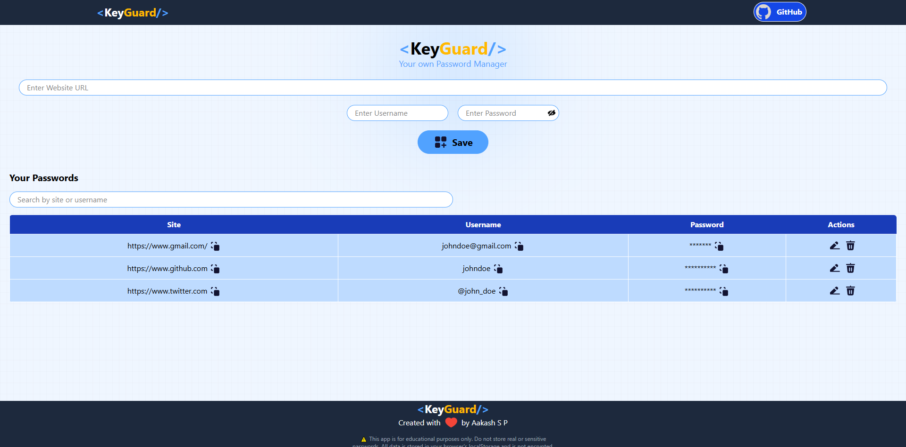

# 🔐 KeyGuard - Your Personal Password Manager

KeyGuard is a simple, intuitive password manager built using **React** for the frontend and **Node.js**, **Express**, and **MongoDB** for the backend. It allows users to securely store and manage their passwords with a clean UI and real-time features.

## 🚀 Features

- 🔐 Add, edit, and delete passwords
- 🔎 Real-time search by site or username
- 👁️ Toggle password visibility
- 📋 Copy site, username, or password to clipboard
- 💾 Data stored in MongoDB via backend API
- 🧪 SweetAlert2 for delete confirmation dialogs
- 🔔 Toast notifications for feedback (react-toastify)
- 💡 Responsive UI using Tailwind CSS
- 🧿 Animated icons using Lordicon

## 📸 Screenshots

 <!-- Optional -->

## 🛠️ Tech Stack

### Frontend
- React (Vite)
- Tailwind CSS
- SweetAlert2
- react-toastify
- uuid
- Lordicon

### Backend
- Express.js
- MongoDB
- Node.js
- CORS
- body-parser

### API Operations

All operations are performed on the root route `/` using different HTTP methods:

- `GET /` - Retrieve all passwords
- `POST /` - Create a new password entry
- `PUT /` - Update an existing password entry
- `DELETE /` - Delete a password entry

## 🧪 How It Works

- Passwords are stored in a MongoDB database with unique IDs generated using the `uuid` library
- The React frontend communicates with the Express backend via HTTP requests
- Input validation ensures all fields are longer than 3 characters
- Passwords are masked with * characters when displayed, and visibility can be toggled while entering or editing passwords using an eye icon.
- Copy-to-clipboard functionality using `navigator.clipboard.writeText()`
- Real-time search filters passwords by site or username

## ⚙️ Installation & Setup

### Prerequisites
- Node.js (v14 or higher)
- MongoDB (running locally on port 27017)
- npm

### Backend Setup

1. Clone the repository:
```bash
git clone https://github.com/your-username/keyguard.git
cd keyguard
```

2. Navigate to the backend folder and install dependencies:
```bash
cd backend
npm install express mongodb body-parser cors
```

3. Start MongoDB service on your machine

4. Start the backend server:
```bash
node server.js
```
The server will run on `http://localhost:3000`

### Frontend Setup

1. Navigate back to the root directory and install frontend dependencies:
```bash
cd ..
npm install
```

2. Start the React development server:
```bash
npm run dev
```
The frontend will run on `http://localhost:5173` (Vite default)

## 🗄️ Database Structure
- Database: `keyguard`
- Collection: `passwords`
- Documents contain: `id`, `site`, `username`, `password`


## ⚠️ Disclaimer

This app is **not secure** for storing real or sensitive passwords. All data is stored in **plain text** in the database and is **not encrypted**.

**For educational/demo use only.**

## 📄 License

This project is open source and available under the [MIT License](LICENSE).